<H1 CLASS="western" style="text-align:center;">Data analysis so far and next steps</H1>

All the results presented below have been generated with scripts
<a href="https://github.com/oliviermirat/MyAIGuide/tree/master/scripts" target="_blank">present in this folder</a>. 

<a name="tableofcontent"/>
<H2 CLASS="western">Table of content:</H2>

[Visualization for Participant1](#visuParticipant1) 
[Vector Autoregression Analysis for Participant1](#varParticipant1) 
[Visualization for Participant2](#participant2) 
[First analysis for Participant8](#participant8) 
[Visualization for Participant 3, 4, 5, 6, 7, 9](#otherparticipants) 

<a name="visuParticipant1"/>
<H2 CLASS="western">Visualization for Participant1:</H2>

Participant1 has the most data, we therefore decided to start by analysing that data. 
For each source of pain (knee pain; finger hand and arm pain; forehead and eyes pain), the analysis
went through 5 stages. Here is an example of those five stages for the knee pain: 

<H4 CLASS="western">Analysis for knee pain:</H4>
1 – First we plot the main stressors recorded on a daily basis that are probably involved in the knee
pain. These stressors are: distance walked, denivelation performed while walking, time driving a car,
number of kilometers swam, and whether or not Participant 1 went cycling on that day.  
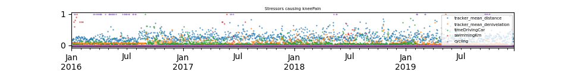  
2 – Then, a linear combination of these stressors is calculated (the weight taken is 1 for all of these
stressors except for “timeDrivingCar” for which the weight was set to 1). This linear combination of
stressors (named “stress” going forward) is then plotted along with the knee pain:  
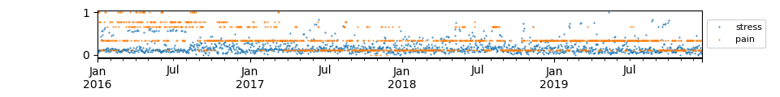  
3 – A rolling mean average of 21 days is then applied on both the stress and pain:  
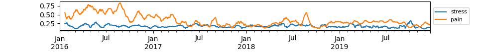  
4 - By looking at the graph above, we can see that most of the orange peaks (peaks in pain level) seem
to be closely preceded by blue peaks (peaks in the stress level). To further investigate whether or not
this is true, a rolling MinMaxScaler is applied on the rolling mean average of stress and pain:  
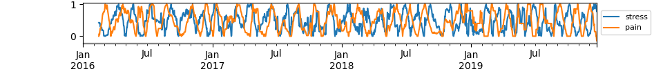  
5 – Looking at the graph above, it appears like there is a shift between the blue and the orange peaks.
We thus calculate the optimal shift of days necessary to align the blue peaks with the orange peaks. For
this knee pain data, we find an optimal shift of 14 days, displayed below:  
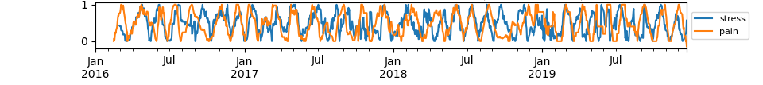  
We can see above that most of the blue and orange peaks are aligned. 

<H4 CLASS="western">Interpretation of the 14 days shift:</H4>
Looking more closely at the raw stress and pain data (without any filter being applied), it appears like a
typical scenario looks like this: 

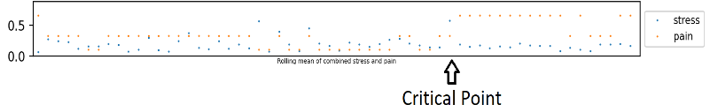 

As seen in the graph above, we typically observe an either gradual or sudden increase in stress which
leads to a sudden increase in pain (at the “critical point”). After the sudden increase in pain, the stress
drops in response to this sudden increase in pain. The pain then typically stays high for a few days
before starting to decrease. 
Since the stress suddenly decreases at the “critical point”, the peak in stress will thus typically happen a
few days before the “critical point” since a rolling mean is being applied. On the other hand the pain
staying high for a few days leads to getting a peak in pain slightly after the “critical point”. Taken
together, those two factors would explain why this shift happens. 
The few cases where the blue and orange peaks don't align could thus be explained by either a
sustained continuation of stress even after the critical point, or by an unusually small or large plateau of
sustained pain following the “critical point”. 

<H4 CLASS="western">Results for finger hand and arm pain and for forehead and eyes pain:</H4>
For the finger hand and arm pain and for the forehead and eyes pain, we also find the peaks in stress
and the peaks in pain to be similarly correlated.  
Interestingly, the optimal shifts are very similar for all regions:  
- for <a href="./kneeAnalysis.pdf" target="_blank">knee pain</a> : optimal shift of 14 days 
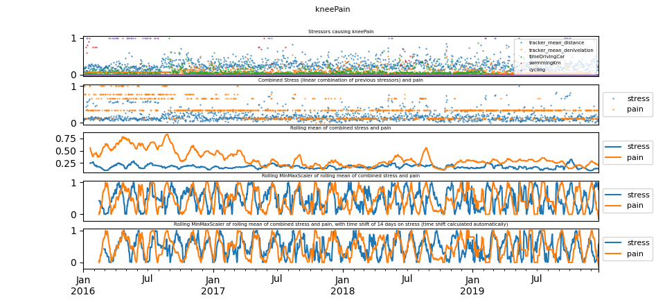  
- for <a href="./fingerHandArmAnalysis.pdf" target="_blank">finger hand and arm pain</a> : optimal shift of 18 days 
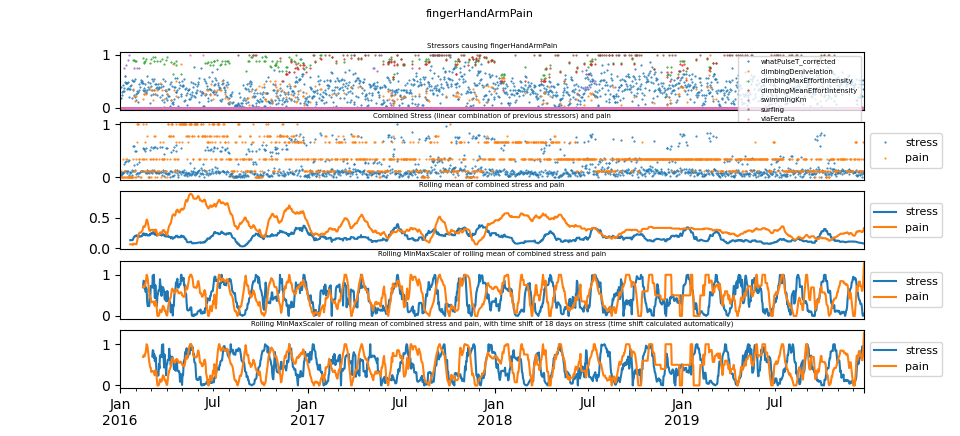  
- for the <a href="./foreheadEyesAnalysis.pdf" target="_blank">forehead and eyes pain</a> : optimal shift of 16 days 
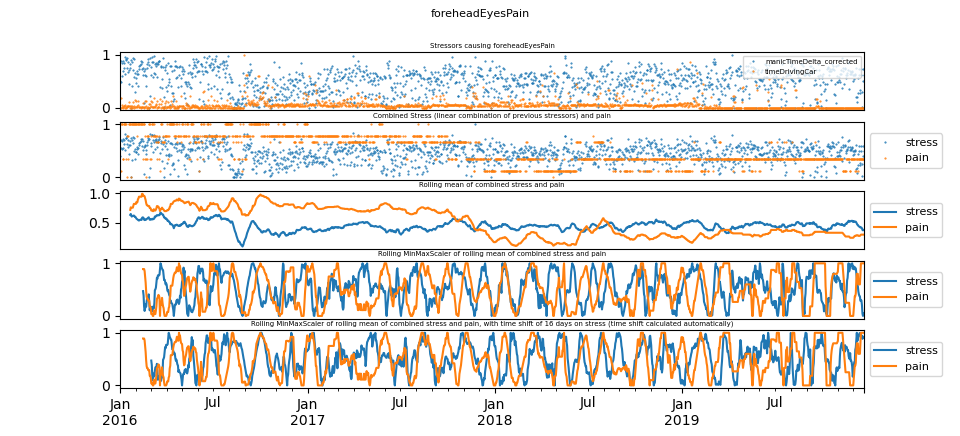  
The results for finger hand and arm pain are less convincing than for the two other regions: this is
probably due to the fact that the stressors were more difficult to record for that region, leading to values
that are most likely less accurate. 

<H4 CLASS="western">Conclusion:</H4>
For all of the three pain regions, we consistently observe a correlation between the peaks in pain and
the peaks of stress applied to the region in pain. Interestingly, the optimal shift is similar for all of the
three main regions. 
In conclusion, this analysis and visualization seem to indicate that for participant 1, the pain in a region
is highly correlated to the stress applied to that region. 
The next step would be to see if the “critical point” previously mentioned could be detected “before it
happens”. In other words, the aim would be to try to find some metrics that predicts when the pain is
going to start reaching a high plateau. 

<H4 CLASS="western">Code:</H4>
The code for this analysis can be found 
<a href="https://github.com/oliviermirat/MyAIGuide/blob/master/scripts/5_exploreDataParticipant1.py" target="_blank">here</a>. 

<a name="varParticipant1"/>

 [Back to table of content](#tableofcontent) 
<H2 CLASS="western">Vector Autoregression Analysis for Participant1</H2>
The visualization shown in the previous section is a good first step, but going forward we want to model the data with a VAR (Vector Autoregression), an LSTM, or some other statistical/ML model. We started this process using a VAR on the data of Participant1, you can read the report about it <a href="./vectorAutoregressionAnalysisForParticipant1.pdf" target="_blank">here</a>. There is still a lot of work to do on this front but the results are very encouraging and coherent with the previous section.  
<a href="./vectorAutoregressionAnalysisForParticipant1.pdf" target="_blank">Read the report on the VAR analysis here</a>.

<a name="participant2"/>

 [Back to table of content](#tableofcontent) 
<H2 CLASS="western">Visualization for Participant2</H2>

We have a fair amount of data for Participant 2 and we will try to apply the same methods as above (visualization, VAR and maybe LSTM).  
This is the data we have for Participant 2 (data collection is still ongoing for this participant and not all data recorded is shown here):
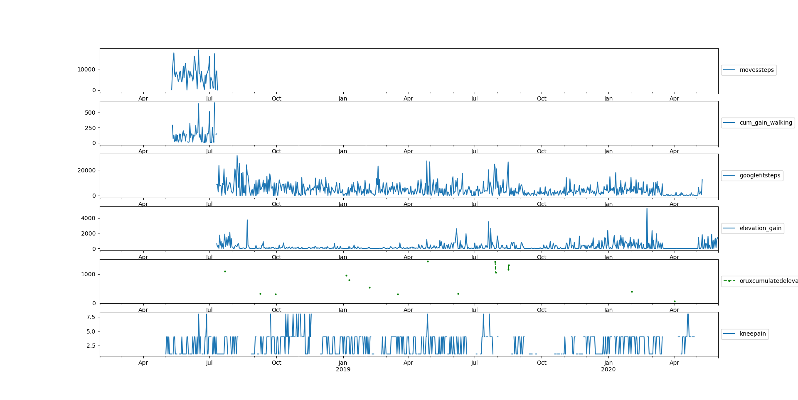

<a name="participant8"/>

 [Back to table of content](#tableofcontent) 
<H2 CLASS="western">First analysis for Participant8</H2>

We've observed a correlation between happiness and pain (especially knee pain) for Participant 8 (happiness is higher when no pain is present): 
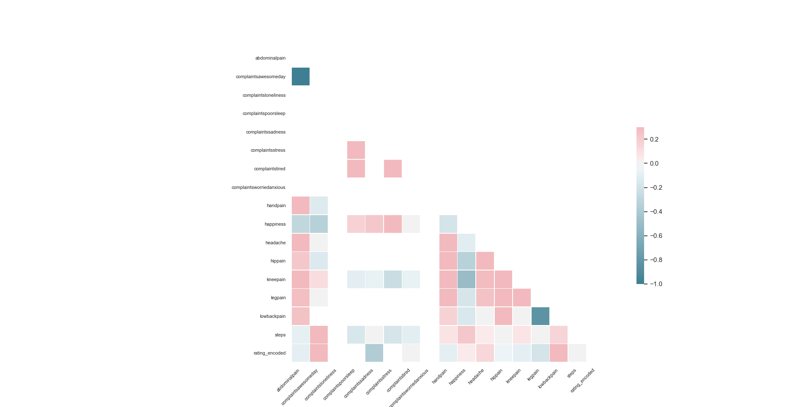  

As shown in the graphs below, we have a lot of different sources of data for Participant 8, so we will hopefully be able to create a recommendation system as well for Participant 8 (data collection is still ongoing for this participant and not all data recorded is shown here): 
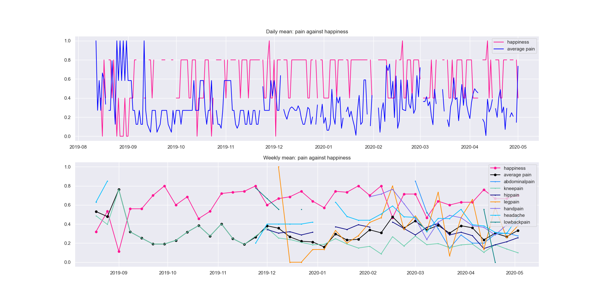 
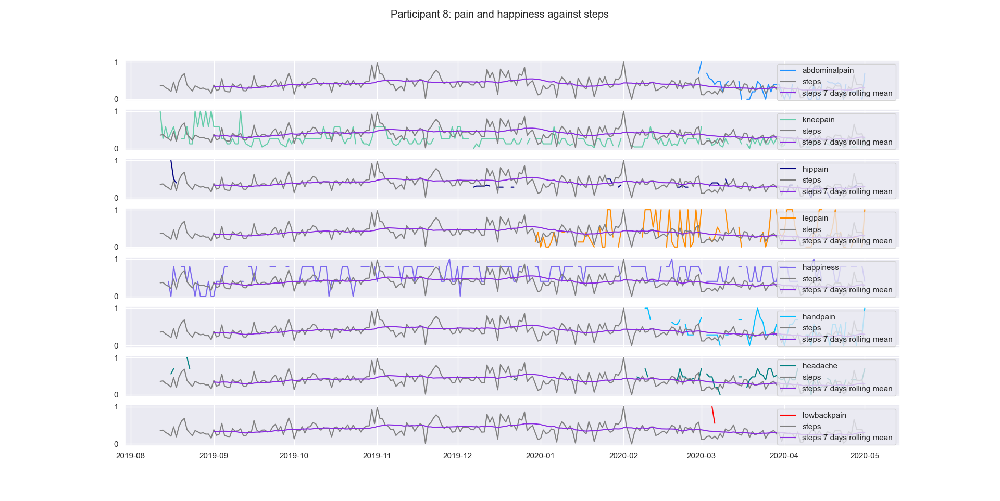 
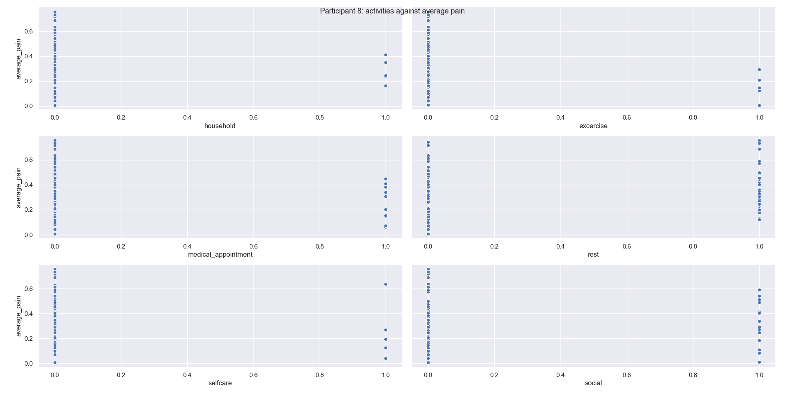 

<a name="otherparticipants"/>

 [Back to table of content](#tableofcontent) 
<H2 CLASS="western">Visualization for Participant 3, 4, 5, 6, 7, 9</H2>

For participant 3, 4, 5, 6, 7 and 9 we have less data, but we may still be able to use it to confirm hypotheses generated by analyzing the data from participants 1, 2 and 8. 

Data for Participant 3: 
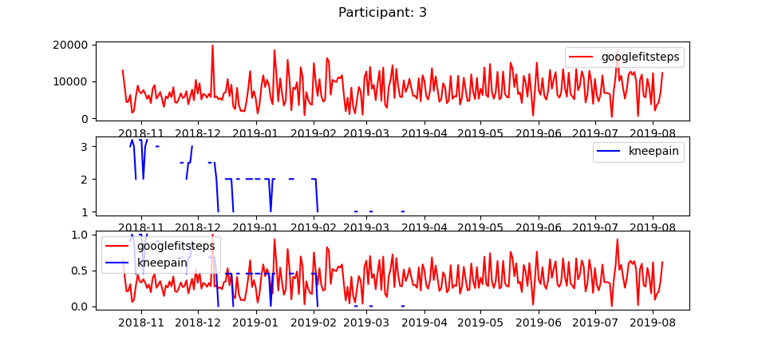 

Data for Participant 4: 
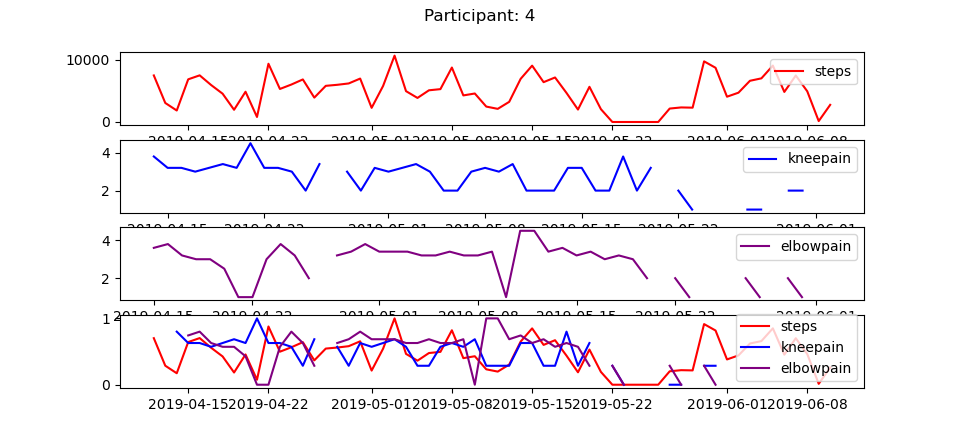 

Data for Participant 5: 
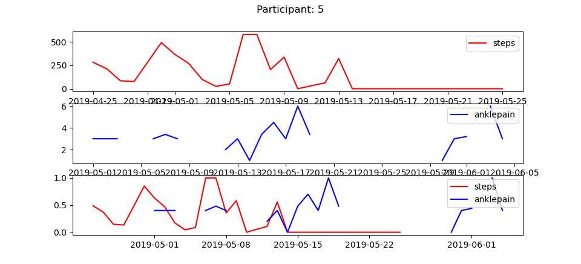 

Data for Participant 6: 
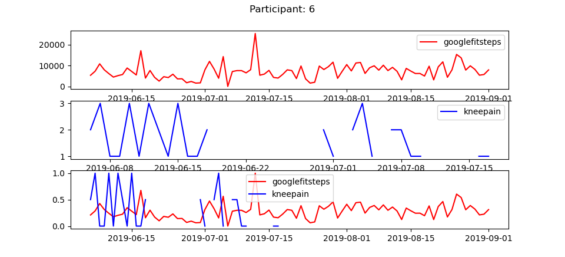 

Data for Participant 7: 
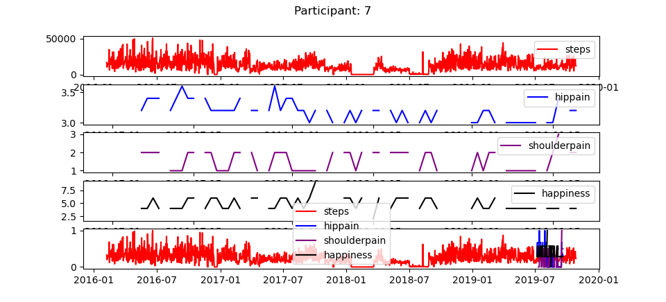 

Data for Participant 9: 
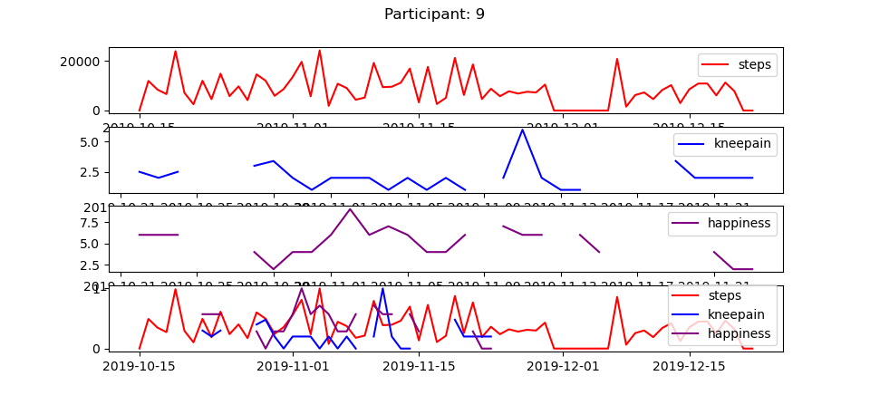 

Importantly, it may be that participants stop logging their pain when they have less pain: that hypothesis could be useful to fill in some of the missing data.
